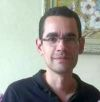

    
    <h1><b>Helder C. R. Oliveira</b>, Ph.D.</h1>
    Instructor at Southern Alberta Institute of Technology (SAIT)

 

I'm still updating this page. To visit the old version click here.

 
I have Bachelor's Degree in Computer Science (Unesp'13, Brazil), M.Sc. (USP'15, Brazil) and Ph.D. (USP'19, Brazil) in Electrical Engineering and from 2019 to 2022 was a Postdoctoral Fellow at the University of Calgary in Canada. Currently, I'm teaching courses in the Software Development Diploma at SAIT.

 
My background is in medical imaging (mammography and digital breast tomosynthesis), machine learning and computer vision. My work with mammography aimed to detect "architectural distortion of the breast", a very sublet sign of what could become breast cancer. I also worked with denoising filters (BM3D, NLM, Wavelet-based) to remove spared noise when the mammography is acquired with a low radiation dose. During my postdoc, I worked mostly with probabilistic graphical models (Bayesian networks and Structural Equation Modelling) and time series.

 
For an up-to-date list of publications, please refer to my Google Scholar. If you want to see some of the projects I worked on, check the link to the Projects at the top of this page.
