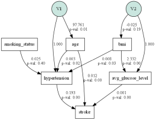
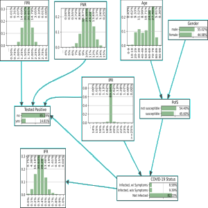
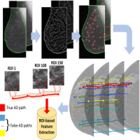
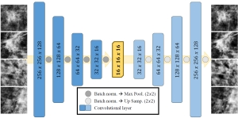
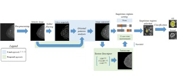
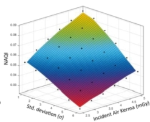
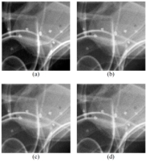
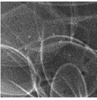

This is an ongoing project of self-study/improvement where I create notebooks/markdowns of the techniques I’m learning. The initial idea is to have a cheat-sheet with notes for my own reference.

**Code created for the papers are listed at the end of this page**.

## Study/Portifolio

- **Survival Analysis**: [[Jupyter Notebook](https://nbviewer.org/github/helderc/portfolio/blob/main/survival-analysis/survival-analysis-01.ipynb)] [[GitHub](https://github.com/helderc/portfolio/tree/main/survival-analysis)]
    - *Language*: Python
	- *Library*: LifeLines
	- *Methods*: Kaplan-Meier, Weibull, Exponential, LogNormal
	- *Evaluation of covariates*: Weibull and Cox Proportional Hazards models.
	
 

- **Bee Images Classification**: [[Jupyter Notebook](https://nbviewer.org/github/helderc/portfolio/blob/main/BeeImage/beeimg_hog_pca.ipynb)] [[GitHub](https://github.com/helderc/portfolio/tree/main/BeeImage)]
	- *Language*: Python
	- *Features*: HOG and Color pixel intensities (vector size of 31296 elements)
	- *Feature transform*: PCA (the best number of components was analyzed)
	- *Classifier*: SVM (linear kernel, binary classification)
	- *Evaluation*: Accuracy, ROC curve and AUC ROC
	
	
## Papers

For a complete list of publications check my <a href="https://scholar.google.com/citations?user=2M2ZAswAAAAJ">Google Scholar</a>.

### Sensitivity Analysis of Stroke Predictors Using Structural Equation Modeling and Bayesian Networks

    

- *Conference*: **2022 IEEE Conf. on Computational Intelligence in Bioinformatics and Computational Biology (CIBCB)**
- *Code*: [Jupyter Notebook](https://github.com/helderc/sem-bn-stroke)
- *DOI*: [CIBCB55180.2022.9863028](https://doi.org/10.1109/CIBCB55180.2022.9863028)

 

### Decision Support for Infection Outbreak Analysis: the case of the Diamond Princess cruise ship

    

- *Conference*: **2021 IEEE Symp. Series on Computational Intelligence (SSCI)**
- *Code*: [Jupyter Notebook](https://github.com/helderc/bn-diamond-princess)
- *DOI*: [SSCI50451.2021.9660140](https://doi.org/10.1109/SSCI50451.2021.9660140)

 

### A cross-cutting approach for tracking architectural distortion locii on digital breast tomosynthesis slices

    

- *Journal*: **Biomedical Signal Processing and Control**
- *DOI*: [10.1016/j.bspc.2019.01.001](https://doi.org/10.1016/j.bspc.2019.01.001)

 

### Exploratory learning with convolutional autoencoder for discrimination of architectural distortion in digital mammography

    

- *Conference*: **SPIE Medical Imaging 2019: Computer-Aided Diagnosis**
- *DOI*: [10.1117/12.2513021](https://doi.org/10.1117/12.2513021)

 

### Reduction of false-positives in a CAD scheme for automated detection of architectural distortion in digital mammography

    

- *Conference*: **SPIE Medical Imaging 2018: Computer-Aided Diagnosis**
- *DOI*: [10.1117/12.2293388](https://doi.org/10.1117/12.2293388)

 

### Validation of no-reference image quality index for the assessment of digital mammographic images
    

    

- *Conference*: **SPIE Medical Imaging 2016: Image Perception, Observer Performance, and Technology Assessment**
- *DOI*: [10.1117/12.2217229](https://doi.org/10.1117/12.2217229)

 

### Use of Wavelet Multiresolution Analysis to Reduce Radiation Dose in Digital Mammography

    

- *Conference*: **2015 IEEE 28th Intl Symp. on Computer-Based Medical Systems**
- *Code*: [Matlab](https://github.com/helderc/WaveletTransformShrinkThreshold)
- *DOI*: [10.1109/CBMS.2015.35](https://doi.org/10.1109/CBMS.2015.350)

 

### Feasibility study of dose reduction in digital breast tomosynthesis using non-local denoising algorithms

    

- *Conference*: **SPIE Medical Imaging 2015: Physics of Medical Imaging**
- *DOI*: [10.1117/12.2082398](https://doi.org/10.1117/12.2082398)

